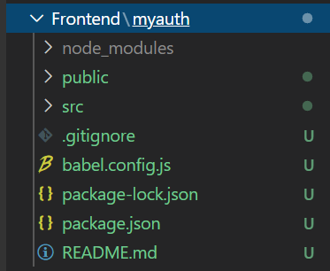
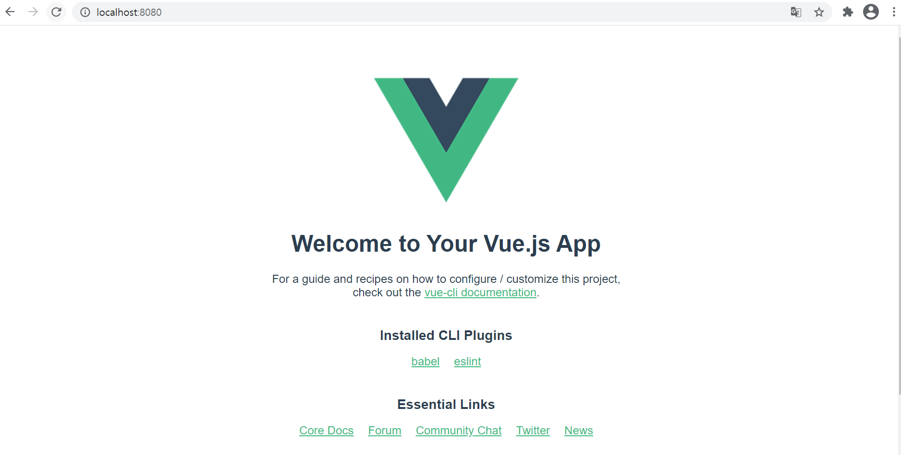
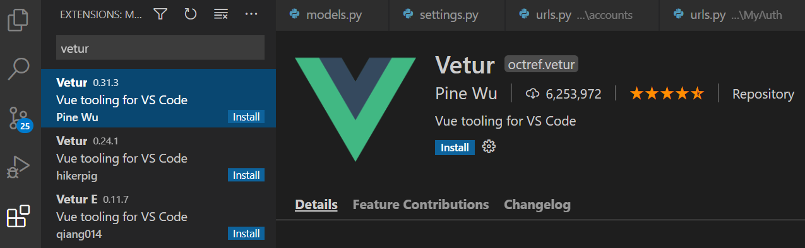
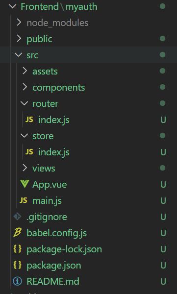

### 1. node.js 설치

```
버전확인
$ node -v
```

> 만약  vscode나 bash를 켜놓은 상태에서 node 설치 후 버전 확인하면 "bash: npm: command not found"에러가난다. 이럴때는 그냥 vscode를 끄고 다시 실행하면된다.

npm 업데이트

```
$ npm install -g npm
```


### 2. CLI 설치

```
$ npm i -g @vue/cli
```


### 3. 프로젝트 생성

```
$ vue create {프로젝트 이름} #소문자로 쓸 것
```

엔터치기



```
$ cd {프로젝트 이름}
```


### 4. 실행

```
$ npm run serve
```



### Tip!

Vue 개발 시 태그 자동완성기능을 위해 왼쪽 바 맨 밑에 Extenstions에서 Vetur를 설치하면 훨씬 편하다!




### 서버 종료

터미널 창에서 ctrl+c 누르기


### vuex/router 설치

> vue/cli 사용시에는 vue add로 설치할 것!

```
$ vue add vuex
$ vue add router
```

y 계속 누르기

*npm i vuex 설치 후에도 자동생성이 안된다면, vue add 사용




*추가적으로 vuetify를 적용한다면,

```
$ vue add vuetify
```

