## 패키지 설치

- CORS 설정

```
$ pip install django-cors-headers
```

## User모델

- User모델을 확장하기 위한 방법으로는 4가지가 있다.

  > https://simpleisbetterthancomplex.com/tutorial/2016/07/22/how-to-extend-django-user-model.html

1. Proxy Model: User 모델 그대로 사용
2. User Profile: User 모델 사용 + 인증과 무관한 정보 추가
3. AbstractUser: USer 모델 그대로 사용(인증기능)+ 필드 커스텀 가능
4. AbstractBaseUser: 자체 인증기능 구현 + 필드를 커스텀할 때 사용


- Django 내부 User모델을 사용할 수 있지만, 추후 모델을 수정할 때 코드의 많은 부분을 고쳐야 하므로 유연성이 떨어짐

  >  https://devlog.jwgo.kr/2020/05/14/recommended-refer-user-model-in-django/

  =>  AbstractUser 모델 사용 추천

  

### AbstractUser 모델

- Django의 User 모델을 그대로 사용할 수 있어 Django 내부 기본 인증 처리 부분을 이용하면 필요한 필드를  커스텀하여 추가할 수 있음

- AbstractUser 모델은 반드시 프로젝트 시작전에 사용할 것! 

  ### settings.py

  참조를 수정하기 위해  AUTH_USER_MODEL 선언 후 사용

  ```
  AUTH_USER_MODEL = "app이름.class이름"
  ```

  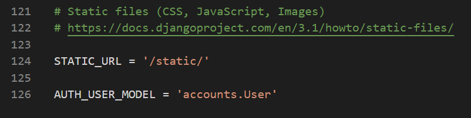

  ### models.py

  User 모델 등록

  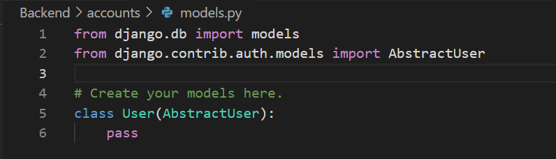

  ### admin.py

  admin 관리자에 User 모델 등록

  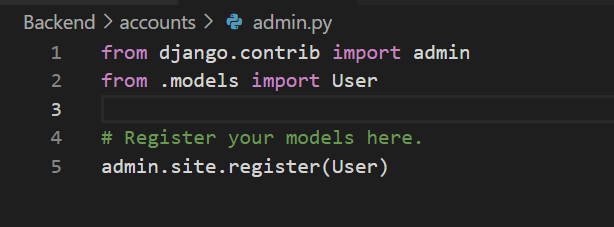

  ### migration

  ```
$ python manage.py makemigrations
  $ python manage.py migrate
  ```


### 관리가 계정 생성  

```
  $ python manage.py createsuperuser
```

## 인증 구현

원래는 views.py에서 signup, login, logout을 직접 구현할 수 있지만 django에서 제공하는 django-rest-auth 패키지를 사용할 수 있음

> https://django-rest-auth.readthedocs.io/en/latest/

- rest_auth: login/logout/pw 변경 및 초기화
- rest_auth.registration: signup/ 소셜로그인


#### 패키지 설치

- rest-auth 설정

  ```
$ pip install django-rest-auth
  ```
- allauth 설정

```
$ pip install django-allauth


```
django-rest-framework 라이브러리 기반의 인증 기능이므로 DRF 설치 및 설정 필요

- DRF 설정

```
$ pip install django-rest-framework
```


### settings.py

- app 등록해주기(rest-auth)

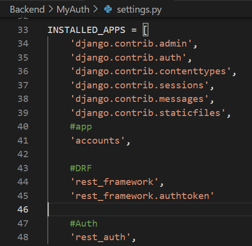

- app 등록해주기(allauth) 

  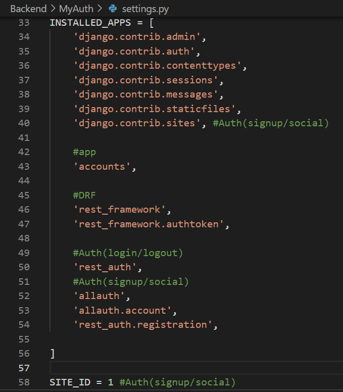

### urls.py

- 로그인, 회원가입 각각 url 등록

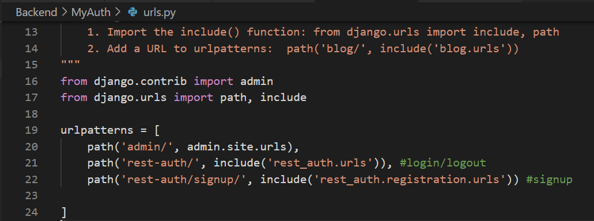


## 추가 User 모델 활용

### views.py

- 우리가 커스텀한 User모델을 쓰기위해서는 User 모델에 바로 접근하는 것이 아니라 get_user_model을 import 해서 User 변수로 정의해서 사용함 

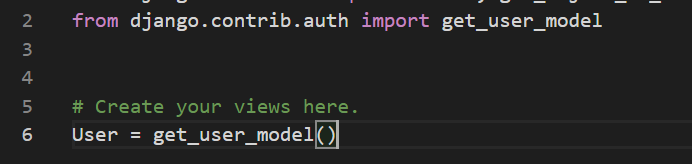


## CSRF 오류

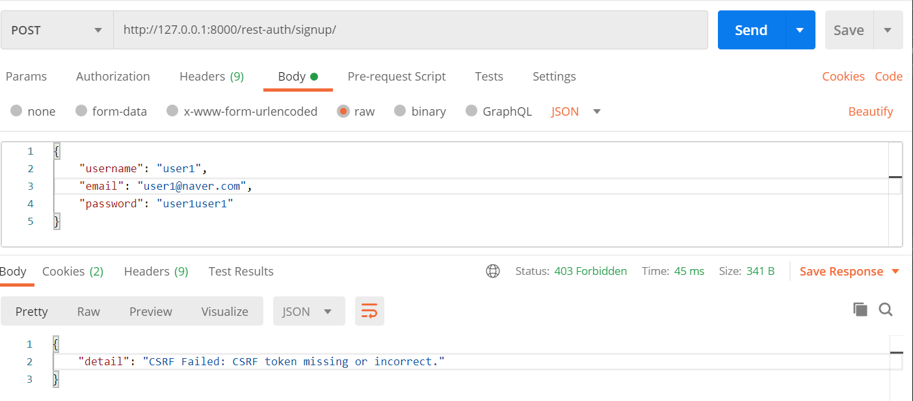

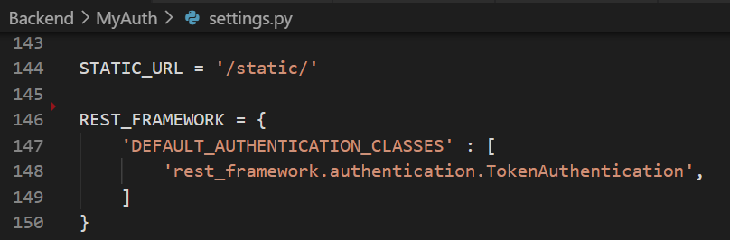

## CORS 오류

- Django settings에 등록

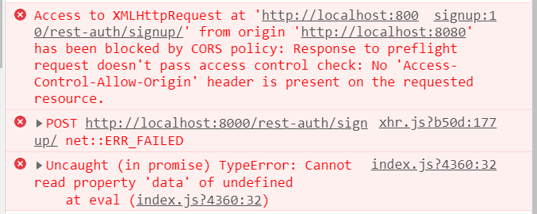

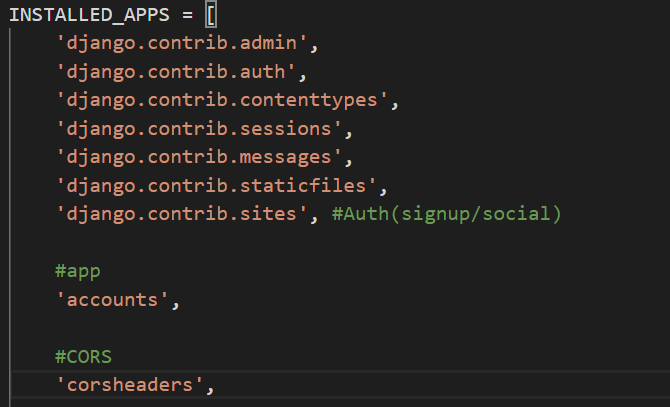

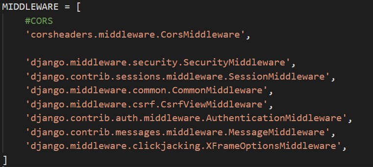

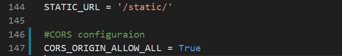


## 사용자 계정 삭제 

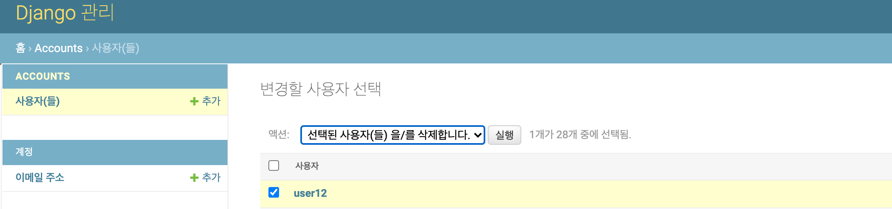


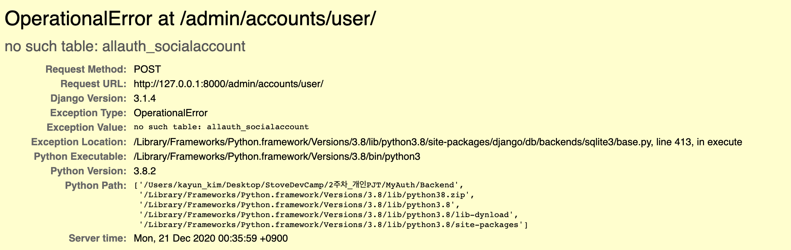


#### 오류해결

- settings.py

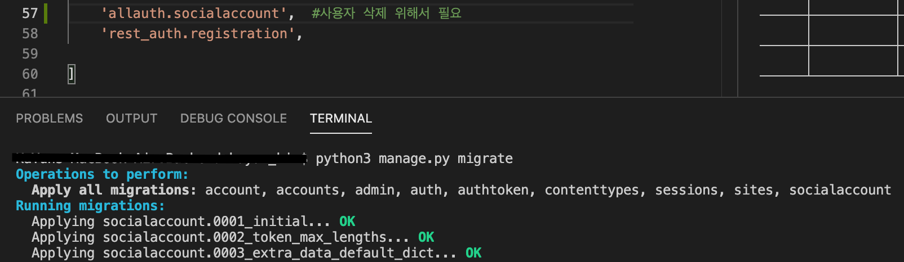

migrate 한번 더 해주고 runserver하기

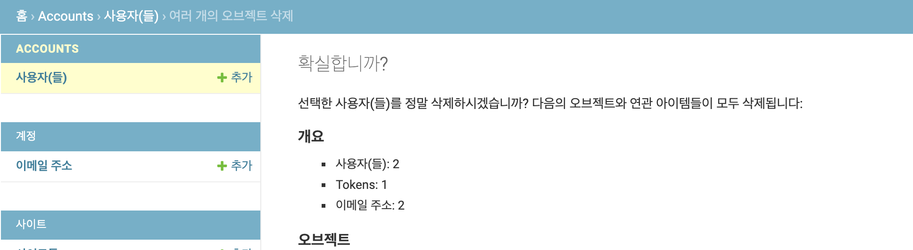


## E-mail 인증

- 사전준비

  1. https://mail.google.com/mail/u/0/?pli=1#settings/fwdandpop

     IMAP 액세스 사용 선택 후 변경사항 저장

  2. https://myaccount.google.com/lesssecureapps?pli=1&rapt=AEjHL4M140Woaw_eH2rw0aUV5kwtRBXkScENdcsZrKUUTljVzQPXPdt1pQqaAM6xJiti6jtPkJdhjzpg1sgB3rGfrZ0Knf_K5A

     보안 수준이 낮은 앱의 액세스 허용

     

- settings.py

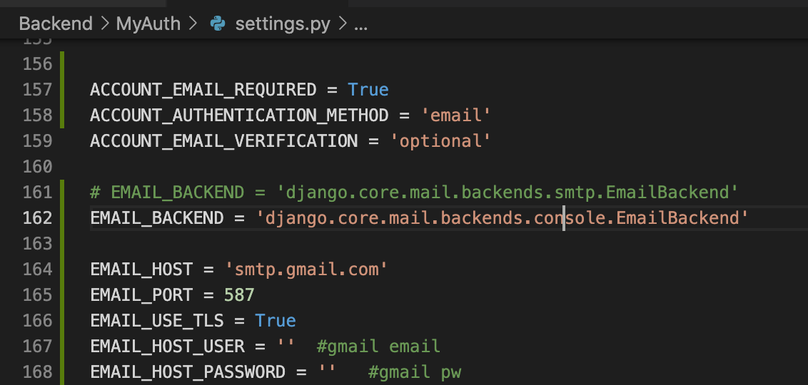

console 창에 찍히는 것으로 정상작동 확인 가능

실제 이메일을 받고 싶다면, 161번의 smtp를 사용하고 162번 줄 주석처리 후 167, 168에 gmail 계정 정보를 입력하면 된다.

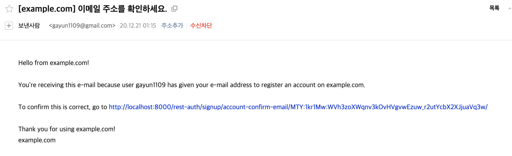


## 해결하지 못한 부분

- 회원가입, 로그인 시 패스워드 길이가 8자리 넘어가면(최소 8자리) 빨간색 나타나는 문제
- admin 회원가입  is_superuser 선택 시  json boolean => python boolean으로 바꾸기
- 캐시