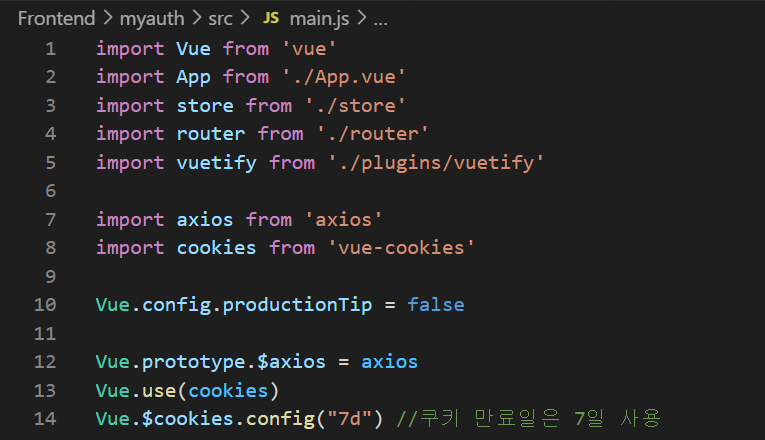
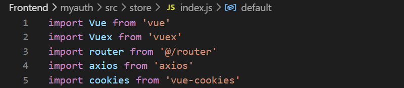
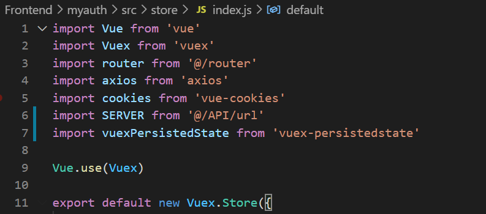
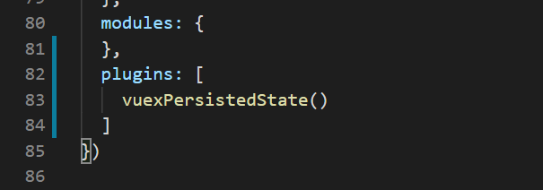

- axios 설치

```
$ npm i --save axios
```

- vue-cookies 설치

```
$ npm i vue-cookies 
```


- main.js

모든 component에서 사용가능하도록 global(전역) 등록




- store/index.js




- vuex-persistedstate 

  - 뒤로 가기 버튼과 같이 화면 이동 시, 화면이 새로고침 되면서 stroe에 저장되어 있던 값들도 초기화 되어버림
  - 이를 방지하기 위해 index.js에서 플러그인 설치 및 화용
  - localstorage를 이용하여 값들을 다시 살려내주는 기능
  - vuex-persistedstate는 store 내 state에 저장된 변수 값을 웹브라우저의 localstorage와 지속적으로 동기화 해주는 역할
  - 따라서 새로 화면이 로딩 되었을 때, 브라우저 localstorage에 있는 내용을 state에 다시 동기화 시켜주게 되어 값들이 다시 그대로 존재하는 원리
  - 단, state에 너무 많은 변수들을 저장하고 있다면, 성능이 떨어지는 단점이 있기 때문에 꼭 필요한 변수들만 저장하는 것으 권장

  

  ```
  $ npm i --save vuex-persistedstate
  ```

  

  

