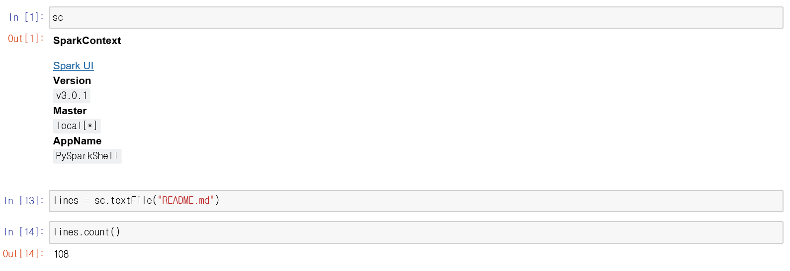
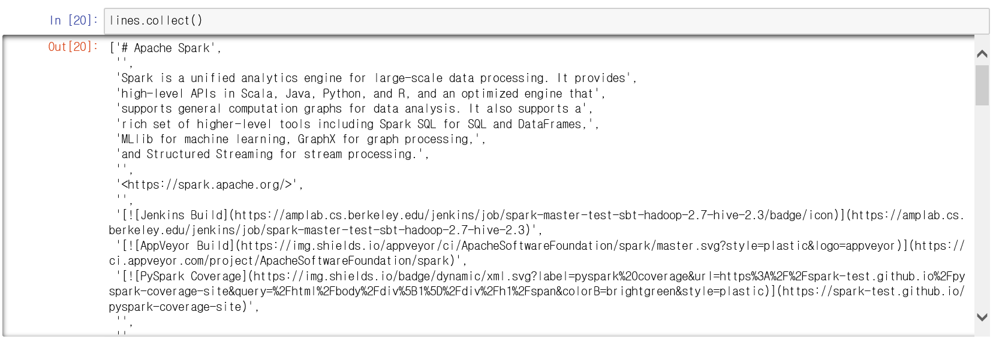
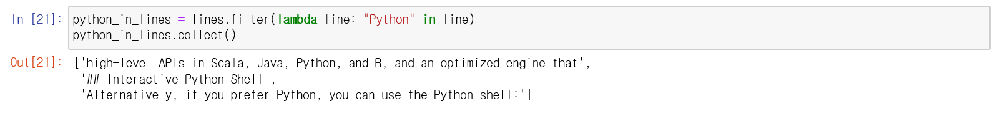
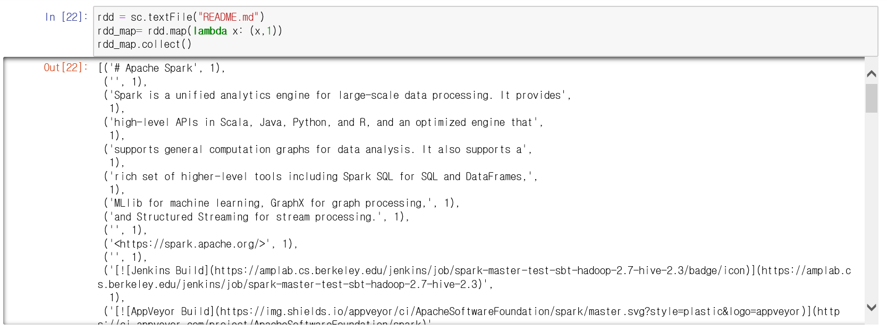
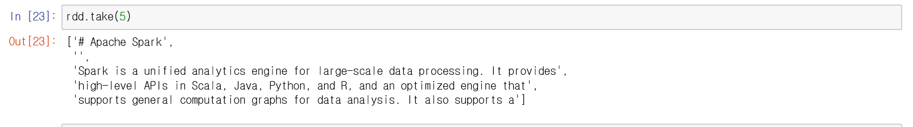
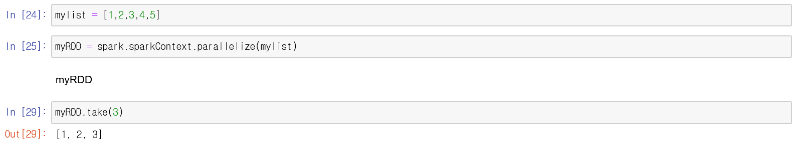
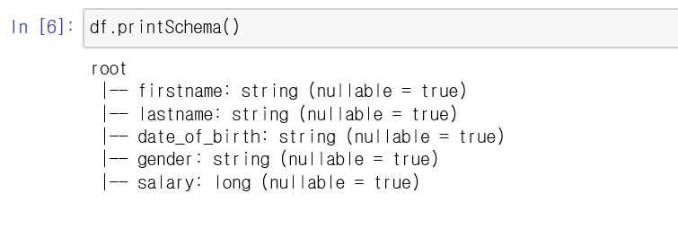
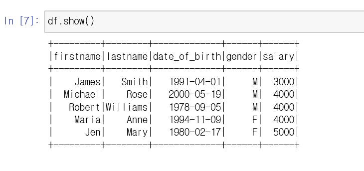

#### Spark Tutorial#1

- Text파일 읽어오기, 라인 수 반환

  

- 전체 텍스트 읽기(collect 함수)

  

- 특정 단어 포함한 문장 반환하기

  

- RDD map함수

  

- 첫 5문장 가져오기(take함수)

  

- 파이썬 리스트를 spark 클러스터로 가져오기

  

- DataFrame 생성

```
data = [("James", "Smith", "1991-04-01", "M", 3000), ("Michael", "Rose", "2000-05-19", "M", 4000), ("Robert", "Williams", "1978-09-05", "M", 4000), ("Maria", "Anne", "1994-11-09", "F", 4000), ("Jen", "Mary", "1980-02-17", "F", 5000)]
```

```
columns = ["firstname", "lastname", "date_of_birth", "gender", "salary"]
```

```
df = spark.createDataFrame(data=data, schema=columns)
```

```
df.printSchema()
```



```
df.show()
```

