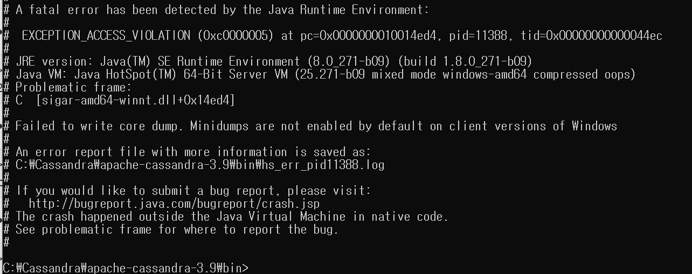
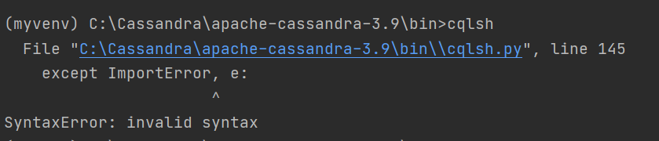
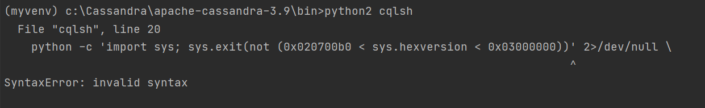
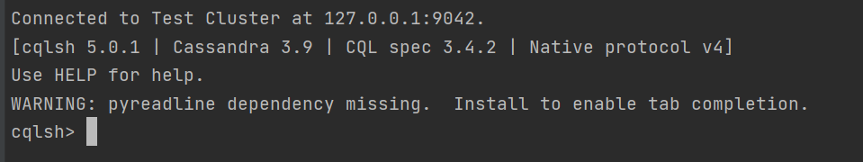

- Cassandra 실행 오류

  ```
  > cd C:\Cassandra\apache-cassandra-3.9\bin>cassandra -f
  ```

  

  => java jdk1.8.0_271 -> jdk1.8.0_251로 다운그레이드


- cqlsh 실행 오류

  

  1. python 2.xx 버전 다운그레이드 
  2. python2 폴더에서 python.exe 실행파일 이름바꾸기 => python2.exe
  3. cqlsh,  cassandra-driver 설치

  ```
  > python2 -m pip install cqlsh
  > python2 -m pip install cassandra-driver
  ```

  4. 실행명령어(먼저 cassandra 실행하고 할 것!)

  

  ```
  c:\Cassandra\apache-cassandra-3.9\bin>python2 cqlsh.py
  ```

  


