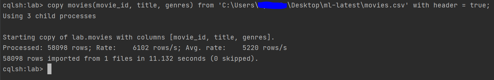
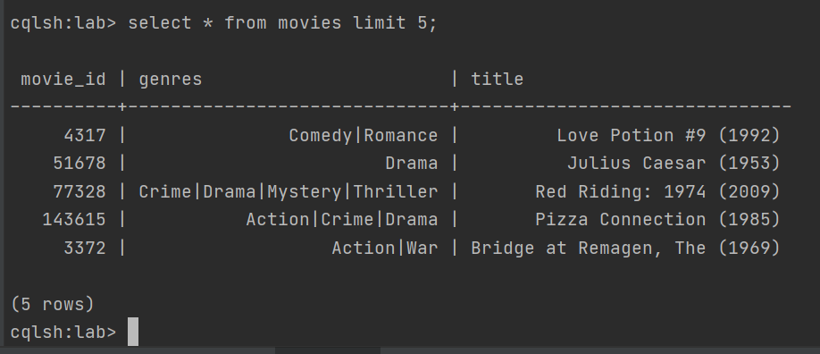
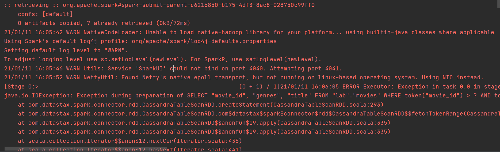

### Cassandra 시작

- keyspace 조회

```
> DESC keyspaces
```

- keyspace 생성

```
> create keyspace lab with replication = {'class': 'SimpleStrategy', 'replication_factor':1};
```

- lab keyspace 사용하기

```
> use lab;
cqlsh:lab>
```


#### movies

- Table 생성

```
> create table lab.movies (movie_id int primary key, title text, genres text);

## table 확인
> desc tables; 
```

- Data 로드

```
> copy movies(movie_id, title, genres) from 'C:\Users\kyunkim\Desktop\ml-latest\movies.csv' with header = true;
```



- 첫 5줄 확인

```
> select * from movies limit 5;
```




#### ratings

- Table 생성

```
> create table lab.ratings (user_id int, movie_id int, rating double, timestamp bigint, primary key((user_id), movie_id));

## table 확인
> desc tables; 
```

- Data 로드

```
> copy ratings(user_id, movie_id, rating, timestamp) from 'C:\Users\kyunkim\Desktop\ml-latest\ratings.csv' with header = true;
```

(일부 데이터 삭제)


#### cassandra 연동

- cassandra connector 모듈

```
import os
os.environ['PYSPARK_SUBMIT_ARGS'] = \
    '--packages com.datastax.spark:spark-cassandra-connector_2.11:2.4.1' \
    ' --conf spark.cassandra.connection.host=localhost pyspark-shell'
```

- 버전 error (version compatibility issue)

```
NativeCodeLoader: Unable to load native-hadoop library for your platform... using builtin-java classes where applicable
Using Spark's default log4j profile: org/apache/spark/log4j-defaults.properties
```

```
Caused by: java.lang.NoClassDefFoundError: org/apache/spark/sql/catalyst/package$ScalaReflectionLock$
```



```
_2.11:2.0.0-M3 => _2.11:2.4.1
```

