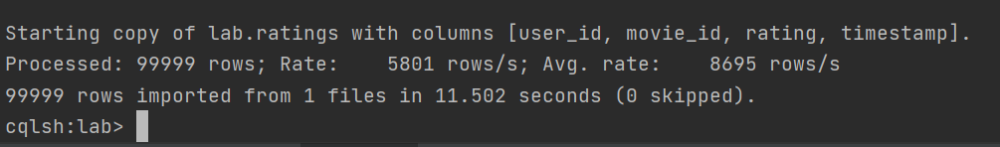

- keyspace 조회

```
> DESC keyspaces
```

- keyspace 생성

```
> create keyspace lab with replication = {'class': 'SimpleStrategy', 'replication_factor':1};
```

- lab keyspace 사용하기

```
> use lab;
cqlsh:lab>
```


#### movies

- Table 생성

```
> create table lab.movies (movie_id int primary key, title text, genres text);

## table 확인
> desc tables; 
```

- Data 로드

```
> copy movies(movie_id, title, genres) from 'C:\Users\kyunkim\Desktop\ml-latest\movies.csv' with header = true;
```


- 첫 5줄 확인

```
> select * from movies limit 5;
```


#### ratings

- Table 생성

```
> create table lab.ratings (user_id int, movie_id int, rating double, timestamp bigint, primary key((user_id), movie_id));

## table 확인
> desc tables; 
```

- Data 로드

```
> copy ratings(user_id, movie_id, rating, timestamp) from 'C:\Users\kyunkim\Desktop\ml-latest\ratings.csv' with header = true;
```

(일부 데이터 삭제)

