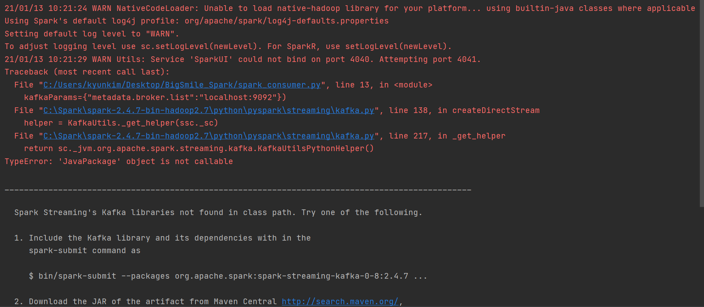
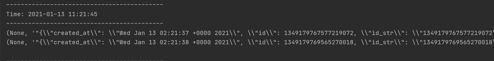

- spark-consumer.py

```
import findspark
findspark.init()

from pyspark import SparkContext
from pyspark.streaming import StreamingContext
from pyspark.streaming.kafka import KafkaUtils


if __name__=="__main__":
    sc = SparkContext(appName="Kafka Spark Demo")
    ssc = StreamingContext(sc,5)
    message = KafkaUtils.createDirectStream(ssc, topics=["test"],
                kafkaParams={"metadata.broker.list":"localhost:9092"})

    message.pprint()

    ssc.start()
    ssc.awaitTermination()
```

- 코드 실행 오류

  TypeError: 'JavaPackage' object is not callable

  Spark Streaming's Kafka libraries not found in class path. Try one of the following.

  1. Include the Kafka library and its dependencies with in the spark-submit command as $ bin/spark-submit --packages org.apache.spark:spark-streaming-kafka-0-8:2.4.7 ...




> https://search.maven.org/search?q=a:spark-streaming-kafka-0-8-assembly_2.11

1. jar 파일로 다운로드
2. spark 설치 경로 내 jars 폴더로 옮기기(C:\Spark\spark-2.4.7-bin-hadoop2.7\jars)
3. pycharm 창 끄고 다시 실행




- kafka-spark-cassandra.py

```
import findspark
findspark.init()

from pyspark import SparkContext
from pyspark.sql import SparkSession
from pyspark.streaming import StreamingContext
from pyspark.streaming.kafka import KafkaUtils

#Cassandra
import os
os.environ['PYSPARK_SUBMIT_ARGS'] = \
    '--packages com.datastax.spark:spark-cassandra-connector_2.11:2.4.1' \
    ' --conf spark.cassandra.connection.host=localhost pyspark-shell'

if __name__=="__main__":
    def handle_rdd(rdd):
        if not rdd.isEmpty():
            global ss
            dataframe = ss.createDataFrame(rdd, schema=['word', 'count'])
            dataframe.show(5)
            dataframe.write \
                .format("org.apache.spark.sql.cassandra") \
                .mode('append') \
                .options(table="words", keyspace="streaming_test") \
                .save()

    sc = SparkContext(appName="Kafka Spark Demo")
    ssc = StreamingContext(sc,5)  #5=no.of seconds
    ss = SparkSession.builder \
        .appName('SparkCassandraApp') \
        .config('spark.cassandra.connection.host', 'localhost') \
        .config('spark.cassandra.connection.port', '9042') \
        .config('spark.cassandra.output.consistency.level', 'ONE') \
        .getOrCreate()

    message = KafkaUtils.createDirectStream(ssc, topics=["test"],
                kafkaParams={"metadata.broker.list":"localhost:9092"})

    lines = message.map(lambda x: x[1])
    transform = lines.map(lambda tweet: (tweet, int(len(tweet.split()))))
    transform.foreachRDD(handle_rdd)

    ssc.start()
    ssc.awaitTermination()
```

