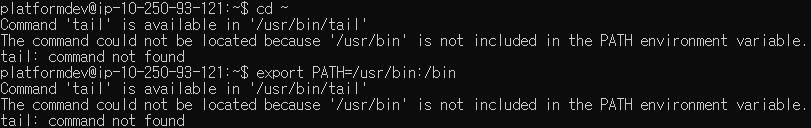
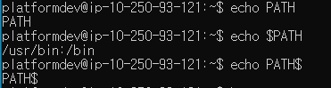
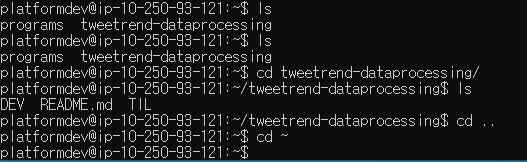
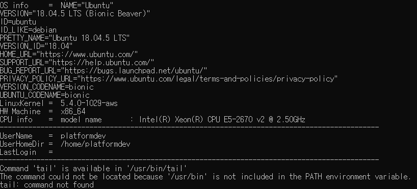

#### AWS Path 설정(일회성) 




```
$ export PATH=/usr/bin:/bin$

## PATH 설정이 되어 있다면,
$ source ~/.bashrc
```






#### PATH 기본 설정

```
$ sudo nano ~/.bashrc
```

```
export PATH=/usr/bin:/bin
```

`ctrl+X` => `y` => `Enter`

```
$ source ~/.bashrc
```

변경사항 반영


#### PATH 영구 설정

- path 경로 설정 오류



```
Command 'tail' is available in '/usr/bin/tail'
The command could not be located because '/usr/bin' is not included in the PATH environment variable.
tail: command not found
```


1. 이전 PATH 설정 반영(이미 설정해놓은 파일 기준)

```
source ~/.bashrc
source ~/.profile
```

2. /.profile 파일 수정

```
$ nano ~/.profile
```

```
변경 전: export PATH=%SPARK_HOME%\bin
변경 후: export PATH=$PATH:%SPARK_HOME%\bin
```

이미 export PATH를 설정했기 때문에 현재 PATH 뒤에 붙이려면, $PATH:하고 경로를 설정해주어야 함.


- `export PATH`  명령어 해석

```bsh
export PATH=$PATH:/opt/netbeans/bin
```

**Let's break this line down.**

- `export PATH`  Here we refer to the `PATH` variable
- `=`  We want to assign it **a new value** using the `=` operator (The rest of the string is the value that will be stored in the `PATH`)
- `$PATH`  We assign the variable `PATH` to the value **that was in the variable before the current command**
- `:` We add a separator for the new value
- `/opt/netbeans/bin`  add a new value to the `PATH`


#### .profile vs .bashrc

`.bash_profile`  or `.profile` 설정 필요(.bash_profile이 없으면 .profile 실행)

> `.bash_profile`과 `.profile`의 차이점은 실행되는 시점이 다르다
>
> `.bash_profile` 의 경우, 로그인 되는시점에 실행
> `.bashrc` 의 경우, 이미 로그인한 시점에서 새로운 콘솔창(세션)을 열때 실행.
>
> 출처: https://sehoonoverflow.tistory.com/29 [세훈오버플로우]

`bash`를 shell로 지정하면 /etc/profile -> .profile -> .bashrc -> /etc/bashrc 순으로 실행됨

`.profile` 와  `.bashrc`의 사용법으로는 `.profile` 에는 환경설정을,  `.bashrc`에는 함수나 alias(별칭)들을 저장하도록 권장한다.

> https://ttend.tistory.com/768


#### spark 실행 오류

```
raise Exception("Java gateway process exited before sending its port number")
Exception: Java gateway process exited before sending its port number
```

- Linux path 설정

```
변경 전: export PATH=$PATH:%SPARK_HOME%\bin
변경 후: export PATH=$PATH:$SPARK_HOME/bin
        export PATH=$SPARK_HOME/bin:$PATH
```

**\표시 사용 안함**

- alias 설정

```
alias python=python3
```


- Java 경로 설정 변경

   java-8-openjdk-amd64 => java-1.8.0-openjdk-amd64 

  새로운 오류메세지

  ```
  import apt_pkg
  ModuleNotFoundError: No module named 'apt_pkg'
  ```

  

- pyspark, python kafka-spark-cassandra.py

```
Traceback (most recent call last):
  File "kafka-spark-cassandra.py", line 32, in <module>
    sc = SparkContext(appName="Kafka Spark Demo")
  File "/home/platformdev/programs/Spark/spark-2.4.7-bin-hadoop2.7/python/pyspark/context.py", line 133, in __init__
    SparkContext._ensure_initialized(self, gateway=gateway, conf=conf)
  File "/home/platformdev/programs/Spark/spark-2.4.7-bin-hadoop2.7/python/pyspark/context.py", line 316, in _ensure_initialized
    SparkContext._gateway = gateway or launch_gateway(conf)
  File "/home/platformdev/programs/Spark/spark-2.4.7-bin-hadoop2.7/python/pyspark/java_gateway.py", line 46, in launch_gateway
    return _launch_gateway(conf)
  File "/home/platformdev/programs/Spark/spark-2.4.7-bin-hadoop2.7/python/pyspark/java_gateway.py", line 108, in _launch_gateway
    raise Exception("Java gateway process exited before sending its port number")
Exception: Java gateway process exited before sending its port number
```

- sudo python kafka-spark-cassandra.py

```
  File "kafka-spark-cassandra.py", line 1, in <module>
    import findspark
ImportError: No module named findspark
```

- spark-submit kafka-spark-cassandra.py

```
java.net.UnknownHostException: ip-10-250-93-121: ip-10-250-93-121: Name or service not known
        at java.net.InetAddress.getLocalHost(InetAddress.java:1506)
```

