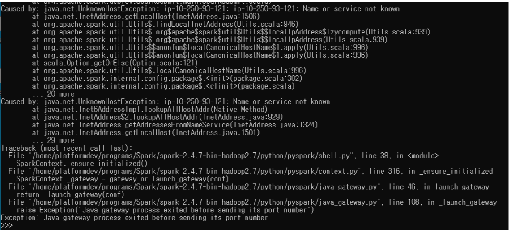

- Java path 설정

```
$ echo "export JAVA_HOME=/usr/lib/jvm/java-8-openjdk-amd64" | sudo tee -a ~/programs/Spark/spark-2.4.7-bin-hadoop2.7/conf/spark-env.sh
```

```sh
$ echo "export JAVA_HOME=/usr/lib/jvm/java-8-openjdk-amd64" | sudo tee -a /usr/lib/hadoop/etc/hadoop/hadoop-env.sh
```

```
cat /etc/resolv.conf
```


- AWS Spark 실행 오류

  - spark-shell, pyspark 명령어 입력 시 

    ```
    java.net.UnknownHostException: ip-10-250-93-121: ip-10-250-93-121: Name or service not known
    ```

    

    ```
    $ sudo hostname 10.250.93.121
    ```

    ```
    $ hostname
    ```

    