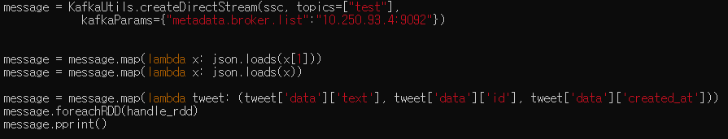

- Spark dataframe row count

```
dataframe.count
```

- Pyspark dataframe count(shape)

```
print((df.count(), len(df.columns)))   #row/column
```

> https://stackoverflow.com/questions/39652767/pyspark-2-0-the-size-or-shape-of-a-dataframe

> https://www.datasciencemadesimple.com/get-number-of-rows-and-number-of-columns-of-dataframe-in-pyspark/


- Twitter API 데이터 건수 확인(5초 당)
  - [코로나] : 2/2/4/6/5
  - [covid] : 81/82/104/93/79/82 
  - [covid, COVID-19] : 103/121/103/108/88/92/85/100/89/95
  - [covid, COVID-19, coronavirus] : 103/121/103/108/88/92/85/100/89/95
  - [bts] : 141/126/119/102/115/147/119/131


- KafkaDStream => json

```
"TypeError: 'TransformedDStream' object is not iterable"
"TypeError: 'TransformedDStream' object is not subscriptable"
Expecting value: line 1 column 1 (char 0)
```



print(type(message)) => 