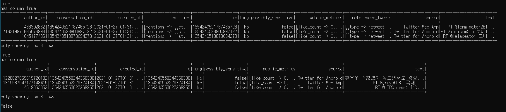

- 시도

```
 referenced_tweets_df = dataframe.columns.contains('referenced_tweets')
```

'referenced_tweets' key error


- 해결방안

```
def has_column(df,col):
	try:
    	df[col]
        return True
    except:
    	return False

dataframe = ss.createDataFrame(rdd)
dataframe.show(3)

print(has_column(dataframe, 'referenced_tweets'))
if has_column(dataframe, 'referenced_tweets'):
    print('has column true')
```




#### dataframe -> json

```
new_df = df.toJSON().map(lambda x: json.loads(x)).collect()
print('new_df', type(new_df[0]), new_df)
```

```
new_dfdf = df.toJSON().collect()
print('new_dfdf', type(new_dfdf[0]), new_dfdf)
```

.PNG)

