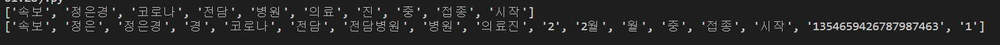

### 형태소 분석

- 꼬꼬마는 자바 기반의 형태소 분석기

```
from konlpy.tag import Okt, Kkma

okt = Okt()   ##  단어 개별 분석
kkma = Kkma()   ## 단어 중복 분석

tweet_message = '[속보] 정은경 코로나 전담병원 의료진부터 2월 중 접종 시작 https://twitter.com/JTBC_news/status/1354659426787987463/photo/1'

tweet_okt = okt.nouns(tweet_message)
tweet_kkma = kkma.nouns(tweet_message)

print(tweet_okt)
print(tweet_kkma)
```




- JAVA 관련에러

konlpy SystemError: java.nio.file.InvalidPathException: Illegal char <*>

> https://www.lfd.uci.edu/~gohlke/pythonlibs/#jpype

1. 현재 python 3.7을 사용하고 있으므로 `JPype1-1.2.0-cp37-cp37m-win_amd64.whl` 파일 다운로드 후 동일 폴더에 저장

2. 모듈 설치하기

   ```
   > pip install JPype1-1.2.0-cp37-cp37m-win_amd64.whl
   ```

