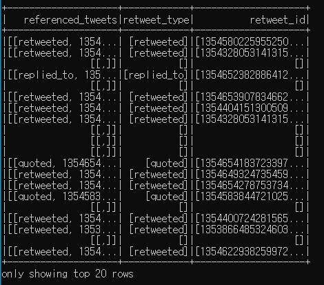
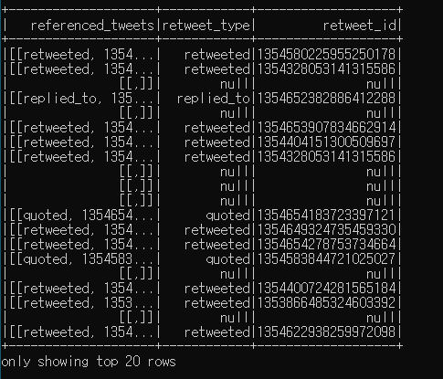
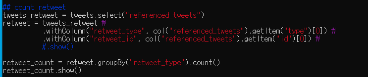
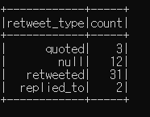
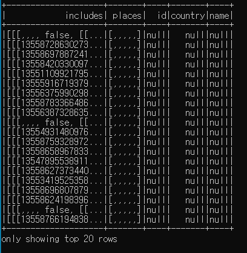
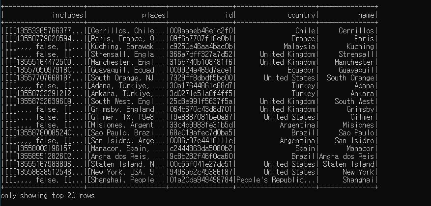
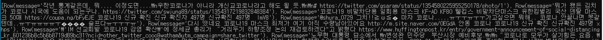
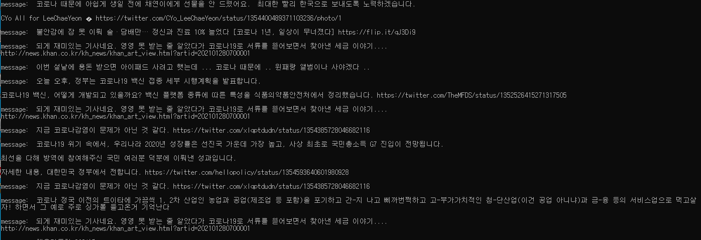

- dataframe dict value -> new column

> https://mungingdata.com/pyspark/dict-map-to-multiple-columns/

```
## count retweet
tweets_retweet = tweets.select("referenced_tweets")

tweets_retweet \ 
.withColumn("retweet_type", col("referenced_tweets").getItem("type")) \
.withColumn("retweet_id", col("referenced_tweets").getItem("id")) \
.show()
```




- list에서 꺼내기

```
## count retweet
tweets_retweet = tweets.select("referenced_tweets")

tweets_retweet \ 
.withColumn("retweet_type", col("referenced_tweets").getItem("type")[0]) \
.withColumn("retweet_id", col("referenced_tweets").getItem("id")[0]) \
.show()
```





- show() 적용 시 변수 적용x




- 에러메세지

```
Traceback (most recent call last):
  File "Trend_Analysis.py", line 67, in <module>
    retweet_count = retweet.groupBy("retweet_type").count()
AttributeError: 'NoneType' object has no attribute 'groupBy'
```


- 정상출력

```
## count retweet
tweets_retweet = tweets.select("referenced_tweets")
retweet = tweets_retweet \
          .withColumn("retweet_type", col("referenced_tweets").getItem("type")[0]) \
          .withColumn("retweet_id", col("referenced_tweets").getItem("id")[0]) \

retweet_count = retweet.groupBy("retweet_type").count()
retweet_count.show()
```




- remove rows with null values

```
df.na.drop()
```







- get a value from dataframe

```
tweet_message = tweets.select("message").collect()
print(tweet_message)   # list 내 Row 반환
```




```
for i in tweet_message:   # 리스트 안에서 Row들을 반복하면서
    print('message: ', i['message'])   # message를 키로 사용하여 value 값을 반환
    print()
```




```
{
    topic: string,
    collected_at: timestamp,
    total_count: 0,
    user_count: 0,
    region_counts: { 'us':0, ...},
    related_words: { 'mask':(cnt, score), ...},
    reputation: {
        'positive': 0,
        'negative':0,
        'neutral':0
    }
    source: {
        'web app': 0,
        'ios': 0,
        ...
    }
}
```


git commit -m "feat/Trend country_code count: Trend_Analysis.py, SGSDEVCAMP-350"