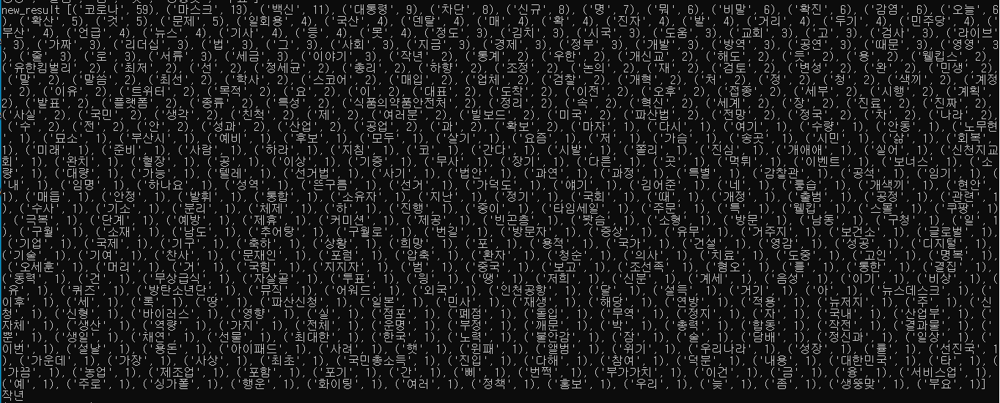
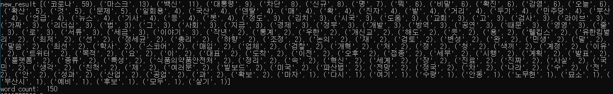
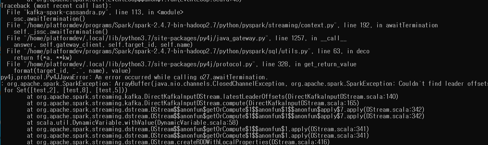

- 1분 당 연관어 개수: 752개




- 따라서 top 20% 비율로 자르고 이에 대한 긍/부정 판별

  


- MongoDB 저장

```
$ pip install mongoengine
```

```
from mongoengine import *

connect('trend', username='bigsmile', password='bigsmile123', authentication_source='admin', host='10.250.93.97',
        port=27017)

class Region(DynamicEmbeddedDocument):
    pass

class Keyword(DynamicEmbeddedDocument):
    pass

class Reputation(EmbeddedDocument):
    positive = IntField()
    negative = IntField()
    neutral = IntField()

class Source(DynamicEmbeddedDocument):
    pass

class TimeTrendOne(Document):
    topic = StringField(required=True)
    collected_at = IntField(required=True)
    total_counts = IntField(required=True)
    user_counts = IntField(required=True)
    retweet_counts = IntField(required=True)
    region = EmbeddedDocumentField(Region)
    related_words = EmbeddedDocumentField(Keyword)
    reputation = EmbeddedDocumentField(Reputation)
    source = EmbeddedDocumentField(Source)
    
# 삽입형식
insert = TimeTrendOne(topic=topic, collected_at=collected_at, total_counts = total, user_counts = author, retweet_counts = retweet, region = region, related_words = related_words, reputation = reputation, source = source)
insert.save()
```


- Datetime 1분씩 증가하도록 계산하기(cassandraDB에 datehour로 접근하기 위해서)

```
import datetime

# 현재 시간
current = datetime.datetime.now()

# 1분 후
one_minute_later = current + datetime.timedelta(minutes=1)

# 1시간 후
one_hour_later = current + datetime.timedelta(hours=1)

# 1일 후
one_day_later = current + datetime.timedelta(days=1)
```


- spark 서버 중단

  