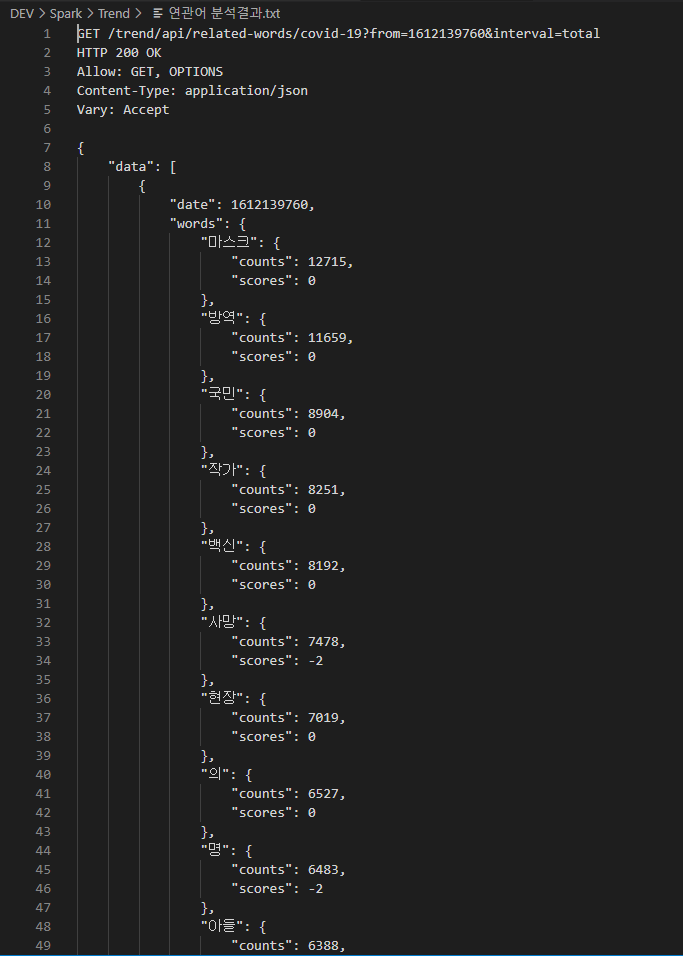
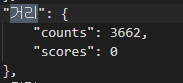
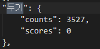
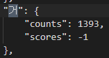
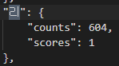
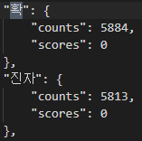
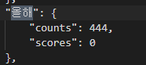
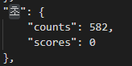

- 총 2037건의 데이터 MongoDB 저장 후 연관어 빈도수 확인 및 불용어 처리하기




- 추측 단어들 리스트

```
위: 위.중증

형: 형집행정지

초: 올해 초, 초.중등

노: 노 마스크, 노 메이크업, 노 재팬

카: 카셰어링

융: 융.복합
```


- `거리두기`의 경우 `거리` 와 `두기` 로 나누어짐

 

=> 거리두기는 한 단어로 봐도 무방해보임 

`두기` 는 stopwords에 추가하고 `거리` count를 `거리두기` 로 반환 


- `거리`의 경우 `거` 와 `리` 로 나누어짐



=> 거리일수도 있고, `코로나 우울(블루), 나만 그런 거 아니지? ` 와 같은 거의 사용이 있을 수 있다고 판단


- `확진자`의 경우`확`과 `진자`로 나누어짐



=> total count로 봤을 때, 비슷하다고 판단하여 `확`은 Stopwords에 포함시키고, 진자는 확진자로 바꾸어 DB 저장


- `올해 초`의 경우 `올해`와 `초`로 나누어짐



=> 초를 `올해 초`로 봐도 무방할 것 같다.


- 1분 동안 count한 계수가 1인 단어들은 모두 제외(이슈라고 볼 수 없음)

상위 5%로 자른 후 뒤에서부터 개수 1인 단어들 탐색 후 제외(처음 상위 20%도 너무 많다고 판단하여 개수 줄임)

