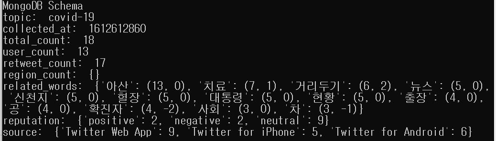

2021-02-05 17:12 ~ 24:00

Mongo DB TimeTrendKor 최초 저장 시간 (final)

**내일 할일**

1. 1/30~1/31 데이터 분석
2. 2/6일 4AM 이후 데이터 분석
3. 발표자료 PPT 확정

-최종발표 자료 준비-

## Spark Streaming & Spark

#### Kafka-Spark Streaming-Cassandra DB

#### Cassandra DB-Spark-Mongo DB

1분 당 트윗 데이터 분석

- total count
- user count
- retweet count
- region count
- source count
- related words(keyword)
- reputation score

