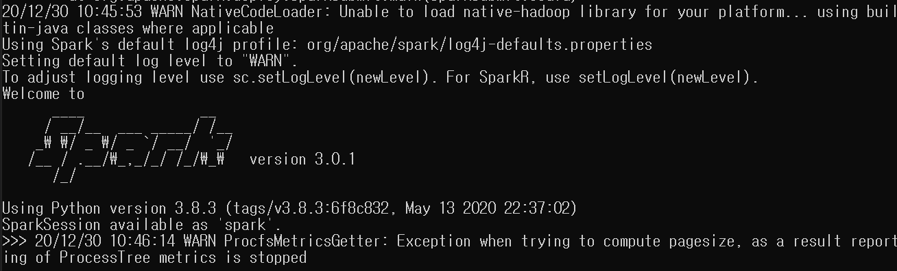

### Spark 설치

JAVA, SPARK, HADOOP 환경변수 설정

```
export JAVA_HOME=C:\Program Files\Java\jdk1.8.0_271
export PATH=%JAVA_HOME%\bin

export SPARK_HOME=C:\Spark\spark-3.0.1-bin-hadoop2.7
export PATH=%SPARK_HOME%\bin

export HADOOP_HOME=C:\Hadoop\bin
export PATH=%HADOOP_HOME%\bin
```

환경변수 설정 후 cmd에서 pyspark로 바로 실행 가능!


### Jupyter notebook 설정

- cmd창에서 jupyter 설치하기

```
> pip install jupyter
```

- 환경변수 설정

```
export PYSPARK_DRIVER_PYTHON=jupyter
export PYSPARK_DRIVER_PYTHON_OPTS='notebook'
```


### Pyspark 정상 실행





### RDD(Resilient Distributed Dataset)

- Spark에서 RDD는 핵심
- 데이터가 비구조적인 경우 사용하기 적합함
- Resilient: 어느 한 노드 작업 실패 시 다른 노드에서 실행함(작업 실패 방지)
- Distributed: 클러스터로 구성된 여러 노드에서 분산 처리
- Dataset: 데이터 구조 의미
- 생성된 RDD는 수정할 수 없는 Read-Only