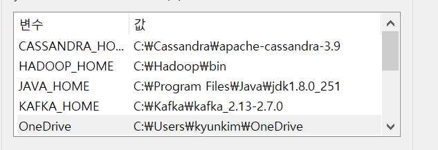
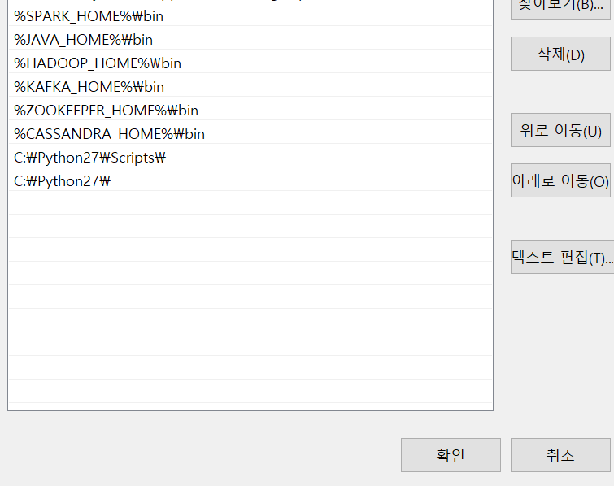

- Spark 3.0.1(=> 2.4.7으로 downgrade함)
- Java 1.8.0_271(spark 실행 시 필요)
- scala 2.13.4(spark 실행 시 필요)
- Hadoop winutils(spark 실행 시 필요)


- pyspark.streaming.kafka 모듈 에러
  - python 3.7 설치
  - pyspark 2.4.6 설치
  - Spark 2.4.7 설치


- Cassandra 설치
  - Java 1.8.0_251(=> downgrade 진행)
  - python2.715(=> 설치 후 path 설정 및 python2로 실행 명령어 번경)


- 시스템 환경 변수 편집

  

  


- Spark 버전확인

```
> spark-submit --version
```

- 가상환경 만들기(해당 파이썬 버전에서 venv 만들면 자동 연결)

```
python -m venv venv
```

- 가상환경 실행

```
$ source venv/Scripts/activate
```

