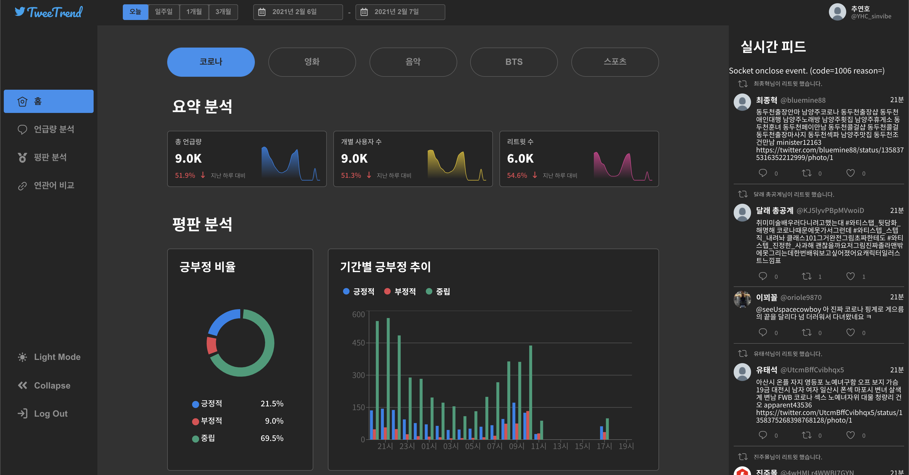

<div align="center">
<a href="http://bigsmile-static.onstove.com/home/covid-19"></a></div>

---

<div align="center"><a >http://bigsmile-static.onstove.com/home/covid-19</a></div>

<br/>

<div align="center"></div>

## Resources

- [Postman - Example Tweets](https://documenter.getpostman.com/view/11536347/TW74jQrc)
- [Postman - TweeTrend](https://documenter.getpostman.com/view/11536347/TW74jQra#intro)
- [Storybook](https://younho9.github.io/tweetrend-storybook)
- [Figma](https://www.figma.com/file/3HZ3hzFyIBHORWB6MVqxna/TweetTrend?node-id=34%3A6)
- [Design Prototype by Adobe XD](docs/TweeTrend.xd)
- [Architecture](https://app.cloudcraft.co/view/60e50b09-952e-47a7-be48-29307faa77bd?key=mX3xEz6obXvNNyA3LV1DPw)

## 🏃‍ Quick Start

**1. ⬇️ Clone Project**

```bash
git clone http://stove-developers-gitlab.sginfra.net/stove-dev-camp/bigsmile/tweetrend-frontend.git
```

**2. ⚙️ Configure Environment Variables**

Create `.env` file in root directory.

[.env.example](/.env.example)

> ☝️ The list of Base URLs currently used is as follows:

```bash
# Base URLs
STATIC_SERVER_BASE_URL=http://bigsmile-static.onstove.com
STATIC_SERVER_PRIVATE=10.250.93.68
REACT_APP_GATEWAY_BASE_URL=bigsmile-gateway.onstove.com
REACT_APP_GATEWAY_PRIVATE=10.250.93.73
REACT_APP_REAL_TIME_SERVER_BASE_URL=http://bigsmile-realtime.onstove.com:8000
REACT_APP_REAL_TIME_SERVER_PRIVATE=10.250.93.76
REACT_APP_TREND_SERVER_BASE_URL=http://bigsmile-trend.onstove.com:8000
REACT_APP_TREND_SERVER_PRIVATE=10.250.93.97
REACT_APP_AUTH_SERVER_BASE_URL=http://bigsmile-auth.onstove.com:3000
REACT_APP_AUTH_SERVER_PRIVATE=10.250.93.118
```

**3. 📦 Install Dependencies**

```bash
yarn install
# or
# npm install
```

**4. 🎉 Start**

```bash
yarn start:client
# or
# npm run start:client
```

**5. 🛠 Build**

```bash
yarn build
# or
# npm run build
```

## Scripts

- Start Mock Server

> ⚠️ Twitter api keys must be specified in the `.env` file.

```bash
yarn start:server
# or
# npm run start:server
```

- Start Storybook

```bash
yarn start:storybook
# or
# npm run start:storybook
```

- Test

```bash
yarn test
yarn test:cov # show test coverage
# or
# npm run test
# npm run test:cov
```

- Lint

```bash
yarn lint
# or
# npm run lint
```

- Format

```bash
yarn format
# or
# npm run format
```

## Tech Stacks

| Area               | Tech Stack                                                                                                                                                                                                                                                                                                                                                                                        |
| ------------------ | ------------------------------------------------------------------------------------------------------------------------------------------------------------------------------------------------------------------------------------------------------------------------------------------------------------------------------------------------------------------------------------------------- |
| Design             |                                                                                                                                                                                                                                      |
| Frontend           |     |
| Linter & Formatter |                                                                                                                                         |
| Mock Server        |                                                                                                                                                                                                                |
| Test               |                                                                                                                                                                                                                                                                                                                    |
| Package Manager    |                                                                                                                                                                                                                                                                                                                  |


## Documents

| 일자             | 내용                                                                                                            |
| ---------------- | --------------------------------------------------------------------------------------------------------------- |
| 2020년 12월 15일 | [React + TypeScript + Storybook + ESLint 세팅](https://til.younho9.dev/log/2020/2020-12-15-201215)              |
| 2020년 12월 16일 | [인증 서비스 기초 강의 & Storybook 글로벌 스타일 설정](https://til.younho9.dev/log/2020/2020-12-16-201216)      |
| 2020년 12월 17일 | [MySQL 데이터베이스 생성](https://til.younho9.dev/log/2020/2020-12-17-201217)                                   |
| 2020년 12월 19일 | [React Router Private Route 등 참고자료 링크](https://til.younho9.dev/log/2020/2020-12-19-201219)               |
| 2020년 12월 21일 | [OAuth 및 개발 컨벤션(Naming & RESTful)](https://til.younho9.dev/log/2020/2020-12-21-201221)                    |
| 2020년 12월 24일 | [Github에 있는 Pull Request를 Local로 가져오기](https://til.younho9.dev/log/2020/2020-12-24-201224)             |
| 2021년 1월 1일   | [TypeScript + React + Storybook으로 디자인 시스템 구축하기](https://til.younho9.dev/log/2021/2021-01-01-210101) |
| 2021년 1월 3일   | [GitHub과 GitLab의 Squash and merge 차이](https://til.younho9.dev/log/2021/2021-01-03-210103)                   |
| 2021년 1월 10일  | [Crontab으로 매일 스크린샷 관리하기](https://til.younho9.dev/log/2021/2021-01-10-210110)                        |
| 2021년 1월 11일  | [Linux 권한 변경](https://til.younho9.dev/log/2021/2021-01-11-210111)                                           |
| 2021년 1월 13일  | [sudo: unable to resolve host 에러 해결](https://til.younho9.dev/log/2021/2021-01-13-210113)                    |
| 2021년 1월 15일  | [ssh를 이용하여 원격 서버와 양방향 파일 전송하기](https://til.younho9.dev/log/2021/2021-01-15-210115)           |
| 2021년 1월 16일  | [주간 콘텐츠 리뷰 - 2021년 1월 1주차 & 2주차](https://younho9.dev/2021-01-1-and-2)                              |
| 2021년 1월 24일  | [주간 콘텐츠 리뷰 - 2021년 1월 3주차](https://younho9.dev/2021-01-3)                                            |

## License

[MIT](/LICENSE) © [younho9](https://github.com/younho9)
