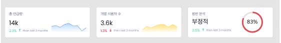
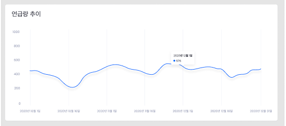
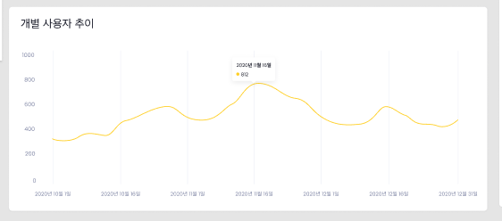
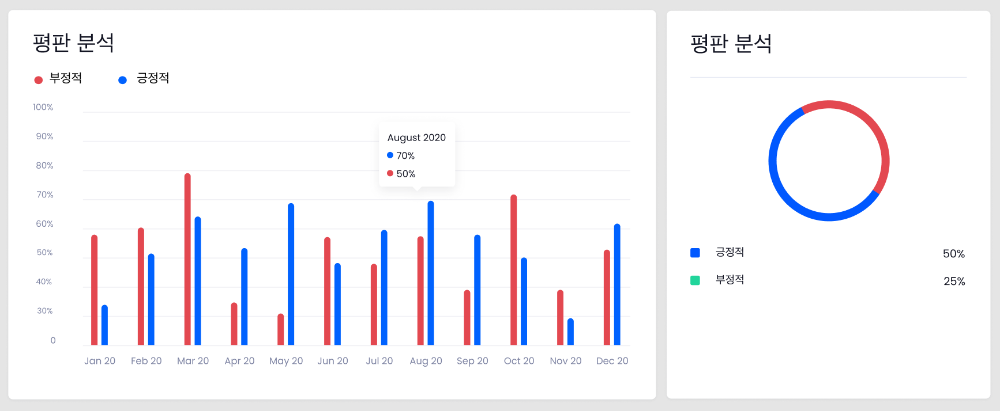
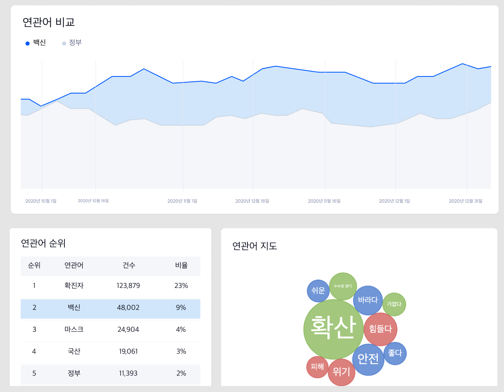
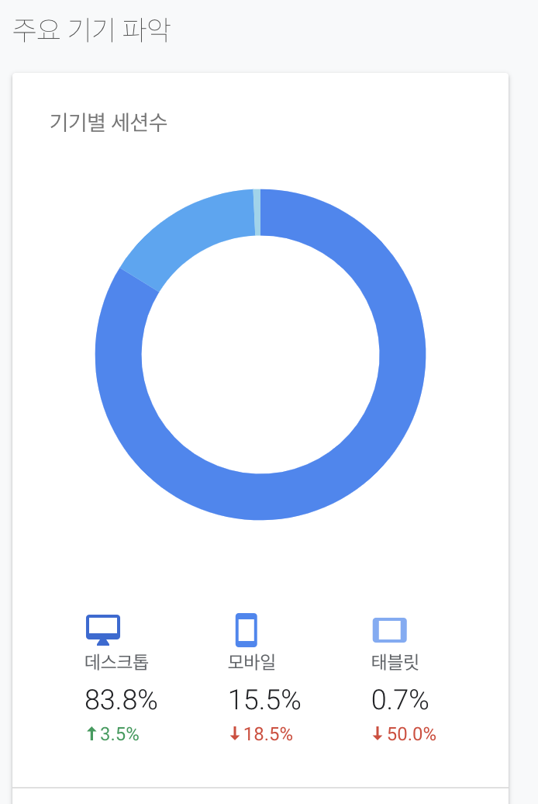

# 2021-01-22 회의록

## 트렌드 대시보드 제공할 위젯 모음

- 실시간 피드

- 언급량 추이 / 개별 사용자 추이 / 긍부정(평판) 분석 요약

   

- 언급량 추이

   

- 개별 사용자 추이

   

- 평판 분석

   

- 연관어 분석 (비교, 워드클라우드, 순위 테이블)

   

- 작성 source (디바이스, 앱 등) 

   예시)

   

-  위치

   - 트윗 제공 데이터 형식

   ```bash
   "includes": {
           "places": [
               {
                   "full_name": "Manhattan, NY",
                   "id": "01a9a39529b27f36",
                   "country_code": "US",
                   "country": "United States",
                   "name": "Manhattan",
                   "place_type": "city"
               }
           ]
       }
   ```

- 실시간 피드확인

- covid-19, 코로나, covid, COVID19

- 트랜드 대시보드

- 언급량: 키워드로 검색한 트윗 개수(라인차트)

- word cloud: 각 단어 개수 총합(조사처리)

- 긍/부정

   - source 사용량(percentage)

   - 각 연관어별 언급량 비교

